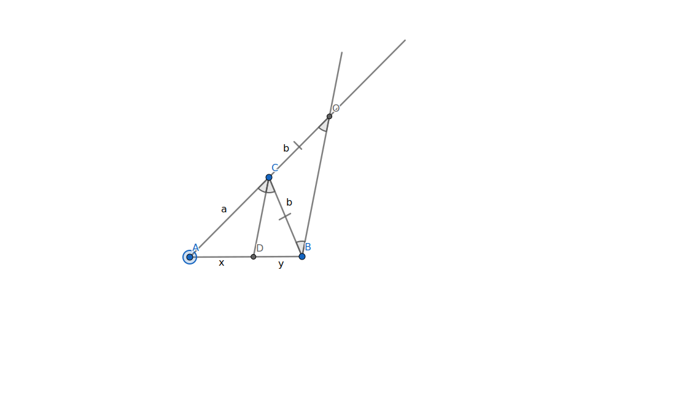
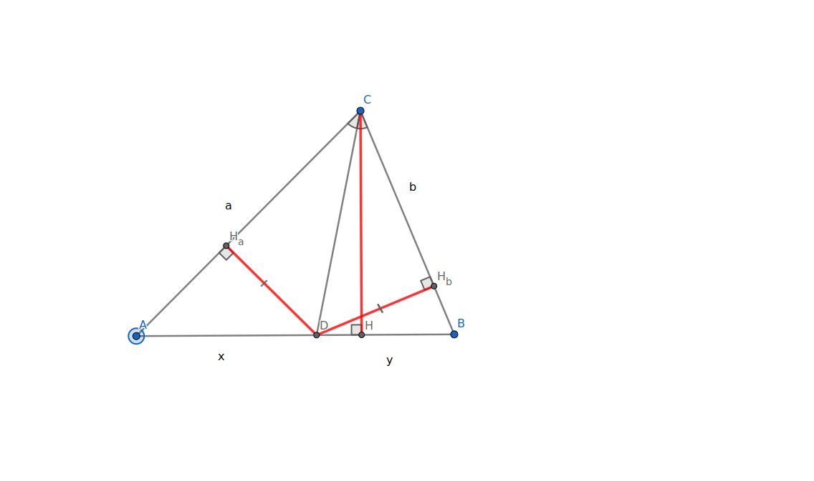

# Теорема Пифагора

!!! note Заметка
    В этой статье представлены самые простые способы доказательства

## Формулировка

В прямоугольном, и только в прямоугольном треугольнике квадрат длины гипотенузы равен сумме квадратов длин катетов

## Доказательство

<figure markdown="span">
    
    <figcaption>Дан прямоугольный треугольник с гипотенуузой *c*, катетами *a* и *b*</figcaption>
</figure>

## Прямое утверждение

В прямоугольном треугольнике квадрат длины гипотенузы равен сумме квадратов длин катетов

### 1 способ {#способ1}

Сделаем дополнительное построение

<figure markdown="span">
    
    <figcaption>Квадрат со стороной *a* + *b*</figcaption>
</figure>

Треугольники *△AKL*, *△BMK*, *△CNM* и *△DLN* равны по 2м катетам

*KMNL* тоже квадрат, поскольку острые углы в прямоугольном треугольнике в сумме дают 90° и все стороны равны *c*

С одной стороны площадь *ABCD* равна произведению его сторон 

(*a* + *b*)² = *a*(*a* + *b*) + *b*(*a* + *b*) = *a*² + 2*ab* + *b*²

<figure markdown="span">
    
    <figcaption>(*a* + *b*)² = *a*² + 2*ab* + *b*²</figcaption>
</figure>

С другой стороны равна сумме площадей фигур, из которых он состоит

 4 $\cdot \frac{1}{2} \cdot$ *ab* + *c*²

Подставим

*a*² + 2*ab* + *b*² = 4 $\cdot \frac{1}{2} \cdot$ *ab* + *c*² $\iff$   
*a*² + 2*ab* + *b*² = 2*ab* + *c*² $\iff$   
*c*² = *a*² + *b*²   

### способ 2 (доказательство Гарфилда) {#способ2 #гарфилд}

Сделаем дополнительное построение

<figure markdown="span">
    
    <figcaption>Прямоугольная трапеция с основаниями *a* и *b*, высотой *a* + *b*</figcaption>
</figure>

Треугольники *△ABK*, *△DKC* равны по 2м катетам

$\angle$*BKC* = 90° т. к. острые углы треугольника в сумме равны 90°

С одной стороны площадь *ABCD* равна произведению полусуммы оснований на высоту

(*a* + *b*) $\cdot \frac{\textit{a} + \textit{b}}{2} = \frac{(\textit{a} + \textit{b})²}{2}$

С другой стороны равна сумме площадей фигур, из которых она состоит

2 $\cdot \frac{1}{2} \cdot \textit{ab} + \frac{1}{2} \cdot \textit{c} \cdot \textit{c} = \frac{\textit{c}² + 2\textit{ab}}{2}$

Подставим

$\frac{(\textit{a} + \textit{b})²}{2} = \frac{\textit{c}² + 2\textit{ab}}{2} \iff$  
*a*² + 2*ab* + *b*² = 2*ab* + *c*² $\iff$   
*c*² = *a*² + *b*²   

## Обратное утверждение

Если в треугольнике со сторонами *a*, *b* и *c* выполняется *c*² = *a*² + *b*², то угол напротив *c* - прямой

Предположим что это не так: $\angle C \neq$ 90°

Тогда построим треугольник *A₁B₁C₁* так, чтобы $\angle \textit{C₁} = 90°, |{B₁C₁}| = a; |textit{A₁C₁}| = textit{b}. Тогда |textit{A₁C₁}| = \sqrt{\textit{a}² + \textit{b}²} = |textit{AC}|$

*△ABC* = *△A₁B₁C₁* по трем сторонам, но тогда $\angle $*C* = 90° - противоречие

