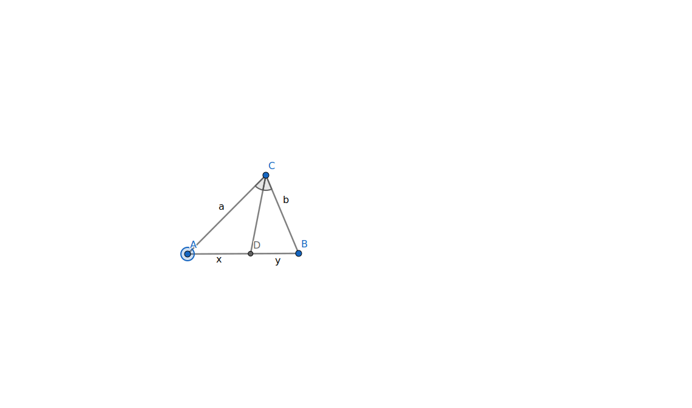

# Свойство биссектрисы треугольника

Биссектриса угла делит противоположную сторону в отношении, равном отношению длин прилежащих сторон

## Доказательство

<figure markdown="span">
    
    <figcaption>Доказать, что $\frac{a}{b} = \frac{x}{y} (или \frac{a}{x} = \frac{b}{y})$</figcaption>
</figure>

### способ 1

Сделаем дополнительное построение

<figure markdown="span">
    
    <figcaption>*BO* || *CD*; *O* ∈ [*AC*)</figcaption>
</figure>

$ \angle CBO = \angle DCB накрест-лежащие; \angle COB = \angle DCB соответсвенные, значит \angle COB = \angle$ CBO. Тогда *△BCO* - равнобедренный по признаку, следовательно |*CB*| = |*CO*|

По теореме Фалеса:

$\frac{|AC|}{|CO|} = \frac{|AD|}{|DB|} \iff$  
$\frac{a}{b} = \frac{x}{y} \iff$  
$\frac{a}{x} = \frac{b}{y}$  
Что и требовалось доказать

### способ 2

Проведем высоты из точки *D* к сторонам *a* и *b*, из точки *C* к стороне *AB*

Площадь треугольника равна полупроизведению основания на высоту. У треугольников *△CDA* и *△CDB* высота *СH* общая, тогда $/frac{x}{y} = /frac{S(△CDA)}{S(△CDB)}$

Из характеристического свойства биссектрисы угла, *D* равноудалена от *AC* и *BC*, то есть |*DH*$_a$| = |*DH*$_b$|. Аналогично получаем $/frac{S(△CDA)}{S(△CDB)} = /frac{a}{b}, значит \frac{a}{b} = \frac{x}{y}$, что и требовалось доказать

