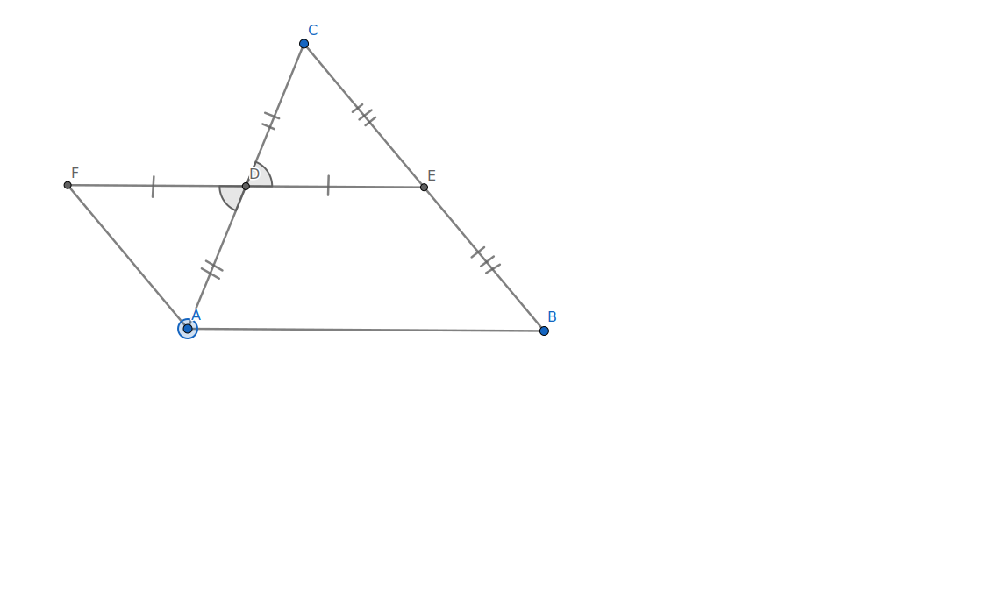
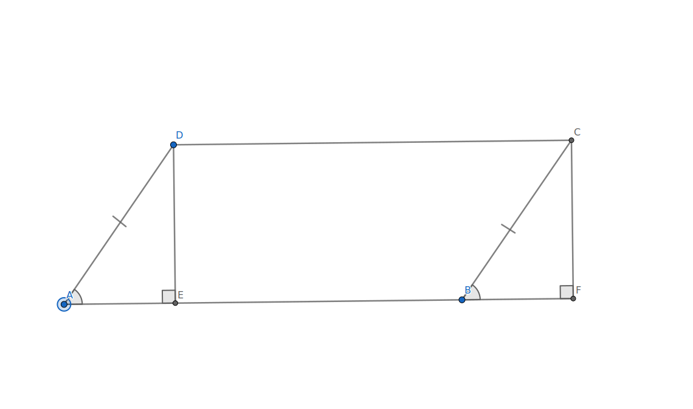
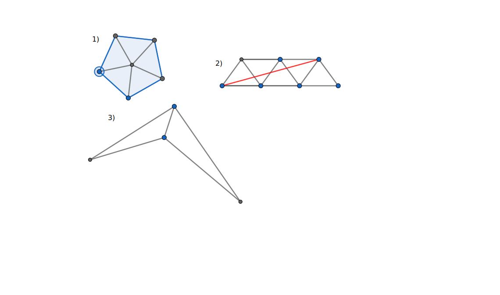
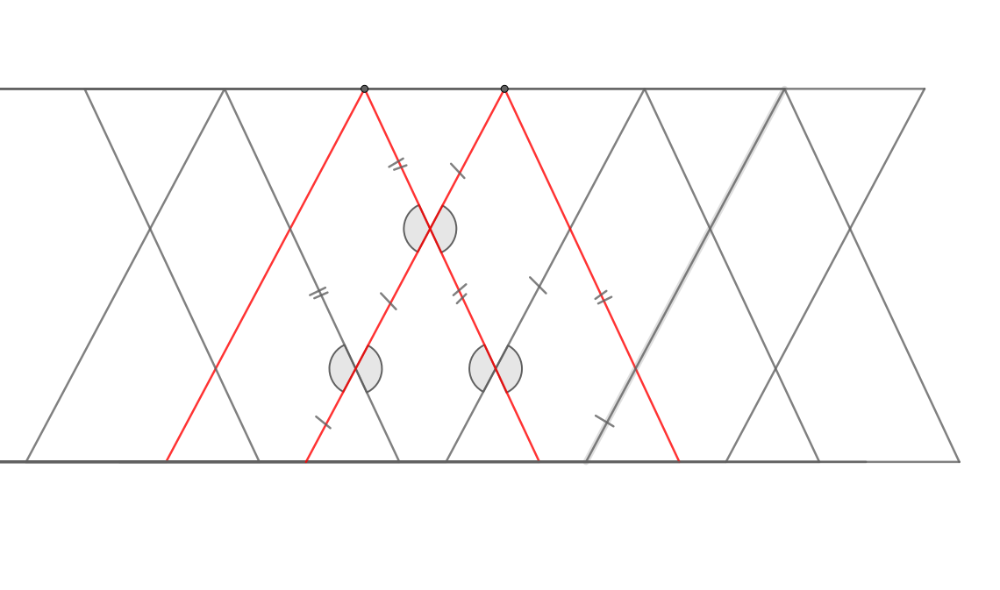

# Теорема Бояй-Гервина

!!! note "Заметка"

    Эту теорему почти одновременно и независимо друг от друга доказали венгерский математик Фаркаш Бояй (он сделал это первым в 1832) и немецкий офицер Гервин (годом позже)

    В завсимости от источника, можно встретить написание "Бойай" или "Бояй"

## Определения {#определения}

Для форулировки данной теоремы необходимо ввести следующие определния

**Равновеликими** называются фигуры с одинаковой площадью

Если взять одну из двух фигур, определенным образом разрезать её на конечное количество частей и из этих частей собрать вторую фигуру, то эти фигуры будут называться **равносоставленными**

прямоугольник *AHCD* и треугольник *△ABC* - равновеликие

## Формулировка {#формулировка}

То, что 2 многоугольника являются равновеликими необходимо и достаточно для того, чтобы они являлись равносоставленными

## Доказательство {#доказательство}

Обратное утверждение достаточно очевидное и доказывается свойством площадей. Для доказательства прямого утверждения потребуются большие усилия

### Лемма 1 {#лемма1}

Любому треугольнику можно сопоставить равносоставленный с ним параллелограмм

Для этого достаточно вспомнить дополнительное построение к теореме о средней линии треугольника

### Лемма 2 {#лемма2}

Каждому параллелограмму соответствует равносоставленный с ним прямоугольник

Для этого из большего угла параллелограмма \angle*D* и соотвественного с ним \angle*С* опустим высоты к противоположному основанию. Тогда прямоугольник *EFCD* - равносоставленный с параллелограммом *ABCD*

### Лемма 3 (транзитивность) {#лемма3 #транзитивность}

Если:

Ф1 и Ф2 равносоставленные
Ф2 и Ф3 равносоставленные

то

Ф1 и Ф3 равносоставленные

Действительно, сначала разрежем 2ю фигуру так, чтобы из этих кусочков можно было собрать 1ю, а потом, не двигая эти кусочки, разрезать их, чтобы получить 3ю фигуру. Тогда и 1я и 2я будут состоять из более мелких, чем изначально, кусочков 2й фигуры

